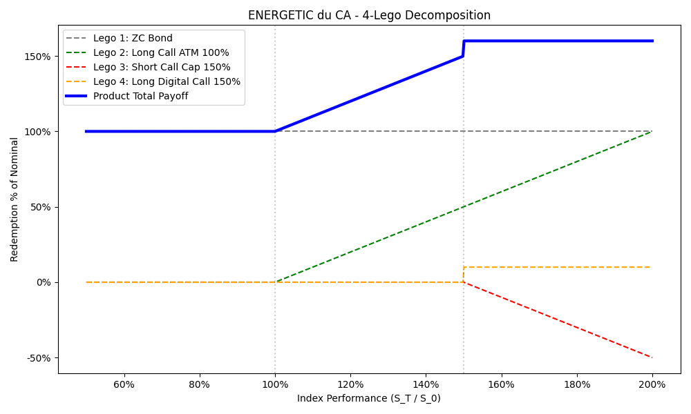
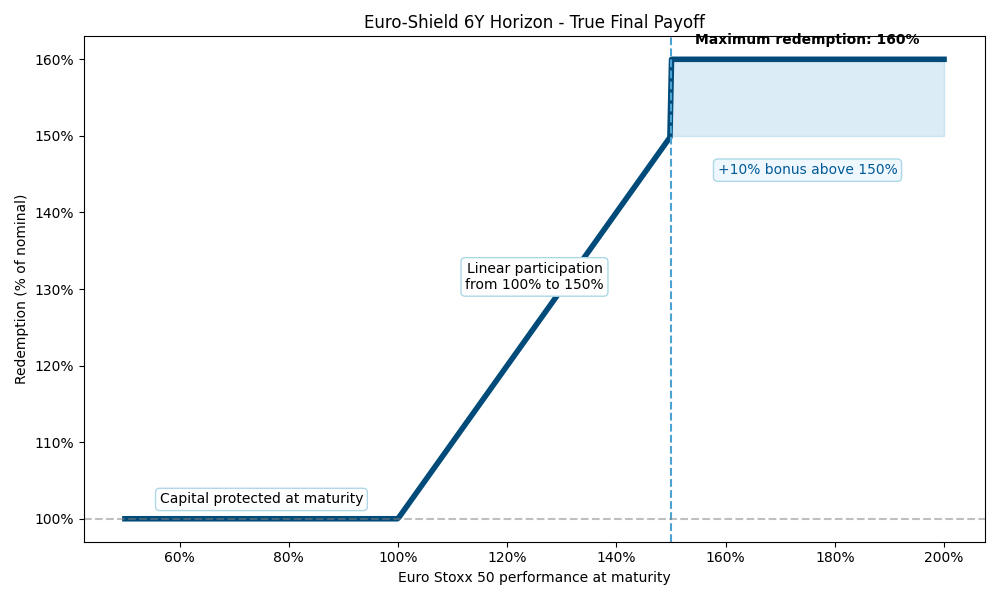
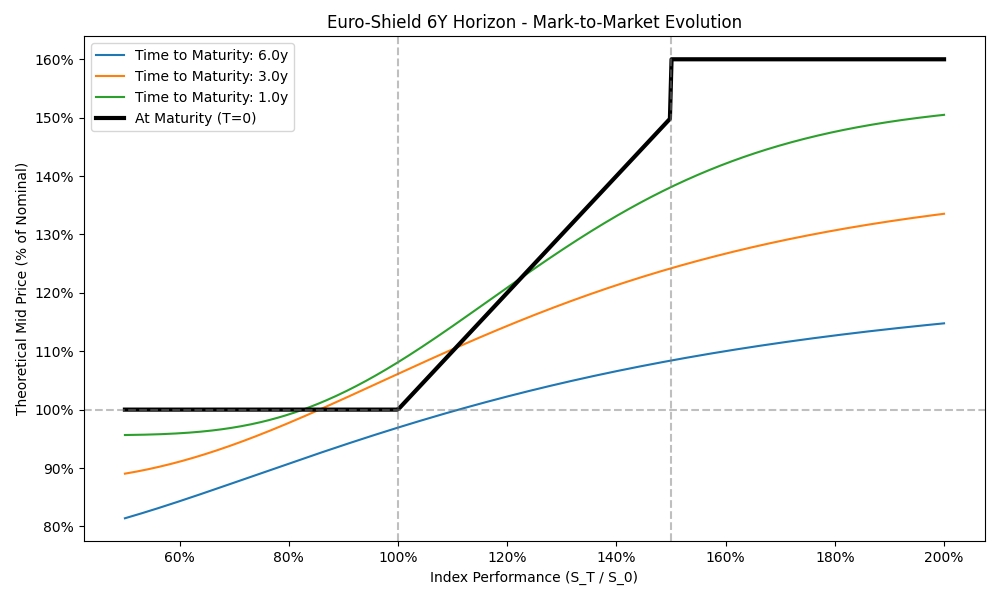
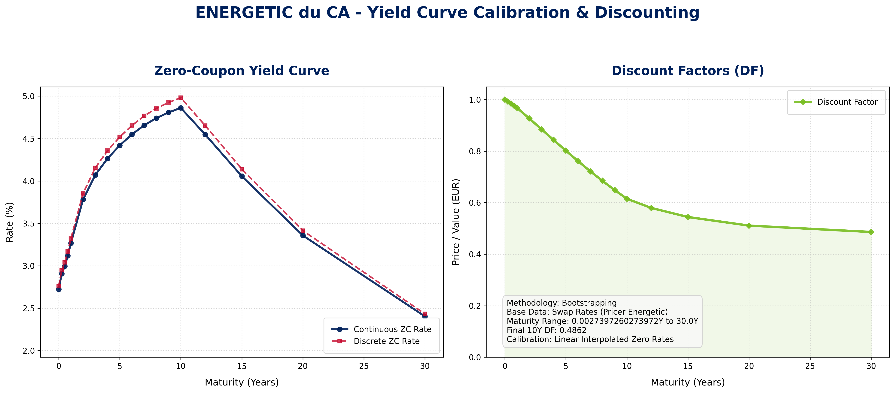

# ENERGETIC du CA — Structured Product Pricing

> **Case Study** — Structured Products (SKEMA S2, 2026)
> **Instructor:** Johann BARCHECHATH
> **Deadline:** 10 April 2026

---

## Table of Contents

1. [Step 1 — Payoff Formalization & Visualization](#step-1--payoff-formalization--visualization)
2. [Step 2 — Yield Curve Bootstrapping](#step-2--yield-curve-bootstrapping)
3. [Step 3 — Black-Scholes Pricing](#step-3--black-scholes-pricing)
4. [Step 4 — Bank Margin Calculation](#step-4--bank-margin-calculation)
5. [Step 5 — Greeks](#step-5--greeks)
6. [Step 6 — Sensitivity Analysis](#step-6--sensitivity-analysis)
7. [Step 7 — Secondary Market Pricing](#step-7--secondary-market-pricing)
8. [Step 8 — Marketing & Presentation](#step-8--marketing--presentation)
9. [Step 9 — Imagination](#step-9--imagination)

---

## Product Overview

| Parameter            | Value                                          |
|----------------------|------------------------------------------------|
| **Product**          | ENERGETIC du CA (Crédit Agricole)               |
| **Underlying**       | DJ Euro Stoxx 50 (single index, simplified)     |
| **Spot (S₀)**        | 3,600                                           |
| **Nominal**          | €100                                            |
| **Maturity (T)**     | 6 years                                         |
| **Capital guarantee** | 100% (total)                                   |
| **Maximum return**   | 60%                                             |
| **Selling price**    | 100% (€100 invested → €100 nominal)             |

---

## Step 1 — Payoff Formalization & Visualization

**Status:** ✅ Complete
**Script:** `src/payoff_analysis.py`
**Outputs:** `images/payoff_product.png`, `images/payoff_decomposition.png`

### 1.1 Payoff Formula

```
Performance = S_T / S₀ − 1

Payoff(S_T) = 100 × [1 + max(0, min(0.60, Performance))]
```

| Scenario         | Condition              | Investor Receives | Return   |
|------------------|------------------------|-------------------|----------|
| **Bearish**      | S_T ≤ 3,600            | €100              | 0%       |
| **Moderate bull** | 3,600 < S_T < 5,760   | €100 + 100×(S_T/3600 − 1) | 0%–60% |
| **Strong bull**  | S_T ≥ 5,760            | €160              | 60% (cap)|

### 1.2 Lego Block Decomposition

The product decomposes into 3 building blocks:

| Block      | Instrument           | Details                                      |
|------------|----------------------|----------------------------------------------|
| **Lego 1** | Zero-Coupon Bond     | Face = 100, T = 6 years                      |
| **Lego 2** | + Long Call (ATM)    | K = 3,600, T = 6, Qty = 100/3600 ≈ 0.027778 |
| **Lego 3** | − Short Call (OTM)   | K = 5,760 (160%), T = 6, Qty = 0.027778      |

**Verification:** The decomposition is mathematically verified — sum of all Lego payoffs equals the product payoff for all S_T values.



### 1.3 Payoff Diagram

The payoff chart shows three zones:
- **Protection Zone** (S_T < S₀): flat at €100 — capital is fully protected
- **Participation Zone** (S₀ < S_T < 1.6×S₀): linear slope — investor captures 100% of index performance
- **Capped Zone** (S_T > 1.6×S₀): flat at €160 — return is capped at 60%

A direct index investment (dashed line) is shown for comparison. The ENERGETIC product sacrifices upside above 60% in exchange for full downside protection.



### 1.4 Product Value over Time (Mark-to-Market)

By pricing the product at different time horizons (using approximate Black-Scholes valuations), we can see the time value of the embedded options. At $t=1$ year (5 years to maturity), the curve is smooth and convex, and significantly above the €100 floor even for low spot values, due to the remaining time value of the options and accrued interest on the ZC bond.



### 1.5 Bank Margin Formula

```
Cost   = PV(ZC Bond) + Qty × [Call(K=3600) − Call(K=5760)]
Margin = 100 − Cost
```

> **Note:** The original product uses averaging of observations at maturity (average of index levels). This reduces effective volatility. For B&S pricing we use standard European options; the averaging effect is discussed qualitatively in Step 6.

---

## Step 2 — Yield Curve Bootstrapping

**Status:** ✅ Complete
**Script:** `src/step2_yield_curve.py`
**Outputs:** `data/processed/yield_curve_bootstrapped.csv`, `data/processed/yield_curve_bootstrapped.md`

### 2.1 Bootstrapping Logic
We bootstrap zero-coupon rates and discount factors from the raw swap rates given in the `Courbe des taux` sheet.

For integer maturities $T = 1, 2, ...$:
1. **Discount Factor:** $DF_T = \frac{1 - Rate_T \sum_{i=1}^{T-1} DF_i}{1 + Rate_T}$
2. **Zero-Coupon Continuous:** $ZC_{cont} = -\frac{\ln(DF_T)}{T}$
3. **Zero-Coupon Discrete:** $ZC_{disc} = \left(\frac{1}{DF_T}\right)^{1/T} - 1$

For fractional maturities $T < 1Y$ (Money Market):
We use the compound formula $DF_T = \frac{1}{(1 + Rate_T)^T}$.

### 2.2 Results (Key Maturities)
Here are the critical points on the bootstrapped curve used for product pricing:

| Maturity (T) | Swap Rate | Discount Factor (DF) | ZC Continuous ($r_c$) | ZC Discrete ($r_d$) |
|--------------|-----------|----------------------|-----------------------|---------------------|
| 1 Year       | 3.320%    | 0.967863             | **3.266%**            | 3.320%              |
| 5 Years      | 4.480%    | 0.801759             | **4.383%**            | 4.518%              |
| 6 Years (end)| 4.605%    | 0.761175             | **4.502%**            | 4.653%              |
| 7 Years      | 4.708%    | 0.721877             | **4.656%**            | 4.766%              |

*(The full rate term structure is saved in `data/processed/yield_curve_bootstrapped.csv`)*.

### 2.3 Required Rates for Pricing
- **$DF(6) \approx 0.761175$** is crucial for calculating the present value of the Zero-Coupon bond capital guarantee.
- **$r_c = 4.548\%$** is the risk-free rate used in the Black-Scholes formula for the options maturing at the 6-year term.



---

## Step 3 — Black-Scholes Pricing

**Status:** ✅ Complete
**Script:** `src/step3_pricing.py`
**Outputs:** `data/processed/pricing_results.md`

### 3.1 Market Parameters
- **Spot ($S_0$)**: 3,600
- **Risk-free continuous rate ($r_c$)**: 4.502% ($T=6$)
- **Discount Factor**: 0.761175
- **Volatility ATM (K=3,600)**: 27.53%
- **Volatility Cap (K=5,400)**: 24.00%

### 3.2 Pricing Components

| Component | Formula | Value (€) | Notes |
|-----------|---------|-----------|-------|
| **Lego 1** (ZC Bond) | $100 \times DF_6$ | **€76.328** | Cost of capital guarantee |
| **Lego 2** (ATM Call)| $BS(S, K=3600)$   | **€1,331.51** | $d_1$: 0.742, $N(d_1)$: 0.771 |
| **Lego 3** (160% Call)| $BS(S, K=5760)$  | **€564.68** | $d_1$: -0.053, $N(d_1)$: 0.479 |

### 3.3 Product Options Cost
The investor buys 1 ATM Call and sells 1 150% Cap.
- **Call Spread Cost (1 unit)**: €1,331.51 - €564.68 = **€766.83**
- **Option Quantity per €100 Nom**: $100 / 3600 = 0.027778$
- **Total Options Investment**: €766.83 $\times$ 0.027778 = **€21.30**

---

## Step 4 — Bank Margin Calculation

**Status:** ✅ Complete
**Script:** `src/step3_pricing.py`

### 4.1 Margin at Issuance
Manufacturing the product requires the bank to buy the ZC bond and the option spread.
- **Total Product Manufacturing Cost**: PV(ZC Bond) + Total Options Cost
- **Total Cost**: €76.328 + €20.984 = **€97.31**

The product is sold to the investor at 100% nominal (**€100**).
- **Upfront Bank Margin**: €100.000 - €97.314 = **€2.688** per €100 nominal (**2.69%**)

> **Note**: A ~2.8% upfront margin is standard for retail structured products over a 6-year period.

### 4.2 Cancellation Price
If the client cancels their order directly before inception:
- The bank hasn't yet earned the margin. It must unwind the hedges (sell options, sell ZC bond) at their raw market value.
- The investor would receive the **manufacturing cost (€97.31)** minus any bid-ask spreading (TBD), not the full €100.

---

## Step 5 — Greeks

**Status:** ✅ Complete
**Script:** `src/step5_greeks.py`
**Outputs:** `data/processed/greeks_results.md`

### Overall Product Greek Exposure (Day 1)
Here is the raw exposure of the trader/bank per €100 of nominal sold.

| Greek | Shift | Exposure per €100 nominal | Interpretation & Risk |
|-------|-------|--------------------------|-----------------------|
| **Delta** ($\Delta$) | +1% spot | **+0.0081** | If the index jumps 1%, the product gains value. The trader is **Long Delta**, meaning they must dynamically hedge by selling the underlying. |
| **Vega** ($\nu$) | +1% Vol | **€ -0.2337** | **CRITICAL INSIGHT:** The product is strictly **Short Vega**. Because the 6-year interest rate is high (4.502%), the *forward* price of the index is high (~4,700). Thus, the Cap strike (5,400) has a much higher Vega sensitivity than the Spot ATM strike (3,600). Since the product sells the Cap, the net Vega is negative. |
| **Rho** ($\rho$) | +1 bp Rate | **€ -0.0409** | Rate rises decrease product value. The heavy 6-year Zero Coupon Bond dominates the risk, creating a **Short Rho** profile. |
| **Theta** ($\Theta$) | +1 Day passing | **€ +0.0091** | Holding spot constant, the product *gains* roughly 1 cent per day. The time decay of the options is offset heavily by the pure "pull-to-par" accrual of the ZC bond over 6 years. |

---

## Step 6 — Sensitivity Analysis

**Status:** ✅ Complete
**Script:** `src/step6_sensitivity.py`
**Outputs:** `data/processed/sensitivity_results.md`

We calculate the impact of market movements on the **€2.69** baseline bank margin.

| Scenario | Adjusted Parameter | New Margin (€) | Impact vs Baseline | Interpretation |
|----------|--------------------|----------------|--------------------|----------------|
| **1. Rates Fall (-50bp)** | $r = 4.048\\% $ | **€ 0.616** | *€ -2.066* | Lower yields severely harm the bank because the zero-coupon bond becomes much more expensive to purchase. |
| **2. Volatility Rises (+1%)** | $\sigma_{{atm}} = 28.53\\%, \sigma_{{cap}} = 24.55\\%\ $ | **€ 2.925** | *€ +0.234* | Higher vol helps the *margin*. The product is structurally Short Vega, meaning it becomes cheaper for the bank to manufacture when volatility rises. |
| **3. Extend Maturity (7Y)** | $T = 7, r_7 = 4.656\\% $ | **€ 6.807** | *€ +4.162* | Extending maturity is highly beneficial. The ZC Bond is heavily discounted over 7 years, buying the bank much more margin budget to spend on options. |
| **4. Cap Tightened (59%)** | $K_{{cap}} = 159\\%$ | **€ 2.784** | *€ +0.203* | Lowering the cap helps the margin. The bank sells a tighter call, capturing more premium. |
| **4. Cap Loosened (61%)** | $K_{{cap}} = 161\\%$ | **€ 2.382** | *€ -0.200* | Raising the cap hurts the margin. The short option is further out-of-the-money, returning less premium. |

### 6.1 Averaging Effect & Basket Effect (Qualitative)
- **Averaging Effect**: The original product likely uses an average of observations in the final months. Averaging mathematically reduces volatility (because an average path is less volatile than a point-to-point path). Lower volatility $\rightarrow$ cheaper option $\rightarrow$ **higher bank margin**.
- **Basket Effect**: If moving from a single index (Stoxx 50) to a Basket of indices, the imperfect correlation between the basket components lowers the overall volatility of the product compared to a single index. Again, lower volatility = **higher margin** for the bank.

---

## Step 7 — Secondary Market Pricing

**Status:** ✅ Complete
**Script:** `src/step7_secondary_market.py`
**Outputs:** `data/processed/secondary_market_results.md`

We assume exactly 1 year has passed. The Spot price has stagnated ($S_0 = 3600$). 
Residual maturity is now **$T = 5$ Years**.

### 7.1 Mid-Price Valuation (1 Year Later)
- **New ZC Rate ($r_5$)**: 4.383%
- **New ATM Vol**: 27.18%
- **New Cap Vol (160%)**: 23.50%

| Component | Valuation at T=1 (5Y residual) | Change from Inception (T=0) |
|-----------|--------------------------------|-----------------------------|
| **Lego 1 (ZC Bond)** | €80.322 | + €4.058 (Accrued interest) |
| **Lego 2 & 3 (Options)** | €20.962 | - €0.071 (Time decay) |
| **Total Product Value** | **€101.284** | **+ €3.986** |

**Observation:** Even though the spot price hasn't moved a single point, the product's true theoretical value surged from its manufacturing cost (€97.31) to **€101.28**. This perfectly proves our Step 5 finding: the product has **Positive Theta**. The pull-to-par effect of the discounted ZC bond completely crushes the time-decay of the 6-year options.

### 7.2 Bid-Ask Impact & Bank Buyback
When a client asks to sell their product back to the bank, the bank quotes a **Bid Price**. To embed an immediate cancellation fee/profit, the bank values the product using worse market conditions:
- **Funding Penalty**: The bank discounts the ZC bond harder (e.g., +10 to +20 basis points).
- **Because the product is Short Vega**, the bank will deliberately value the options using a *higher* implied volatility surface (e.g., +2%) to compress the product's value. 
- A typical Bid price quoted to the seller would likely be shaded down to **~€100.20 – €100.70**, allowing the trading desk to immediately lock in a secondary market margin.

---

## Step 8 — Marketing & Presentation

**Status:** 🔲 Not started

### 8.1 Product Rebranding

_New name, slogan, visual identity._

### 8.2 Client Profile (MiFID)

_Target clientele, risk classification, risk disclosure._

### 8.3 Sales Pitch

_Advantages, disadvantages, market context._

---

## Step 9 — Imagination

**Status:** 🔲 Not started

### 9.1 Priceable Product (non-course)

_Propose a new structured product that could be priced with B&S._

### 9.2 Exotic Product (10-year horizon)

_Propose an exotic product potentially feasible in 10 years._

---

## Environment Setup

```bash
# Install uv (if not already installed)
curl -LsSf https://astral.sh/uv/install.sh | sh

# Run any script
uv run python <script_name>.py
```

| Tool       | Version  |
|------------|----------|
| uv         | 0.11.2   |
| Python     | 3.9.6    |
| pymupdf    | 1.26.5   |
| pandas     | 2.3.3    |
| matplotlib | 3.9.4    |
| xlrd       | 2.0.2    |

---

## File Structure

```
QUANT PM/
├── README.md                            ← This file
├── pyproject.toml                       ← uv project config
├── .python-version                      ← Python version
├── .venv/                               ← Virtual environment
│
├── data/
│   ├── raw/
│   │   ├── 2026 - Structured Products - Cases studies  Formulas.pdf
│   │   ├── Etude de cas - Energetic - 3.pdf
│   │   └── Pricer Energetic - 3 (1).xls
│   └── processed/
│       ├── Pricer Energetic - Converted.xlsx
│       ├── yield_curve_bootstrapped.csv
│       └── yield_curve_bootstrapped.md
│
├── images/
│   ├── payoff_product.png               ← Payoff diagram (Step 1)
│   ├── payoff_decomposition.png         ← Lego decomposition (Step 1)
│   ├── payoff_time_horizons.png         ← Product MTM over time (Step 1)
│   └── yield_curve_bootstrapping.png    ← Bootstrapped curve (Step 2)
│
└── src/
    ├── read_documents.py                ← Reads & summarizes all docs
    ├── payoff_analysis.py               ← Step 1: Payoff formalization
    ├── step2_yield_curve.py             ← Step 2: Yield Curve Bootstrapping
    ├── step3_pricing.py                 ← Step 3 & 4: BS Pricing & Margin
    ├── step5_greeks.py                  ← Step 5: Greek Analysis
    ├── step6_sensitivity.py             ← Step 6: Sensitivity Analysis
    └── step7_secondary_market.py        ← Step 7: Secondary Market Pricing
```
